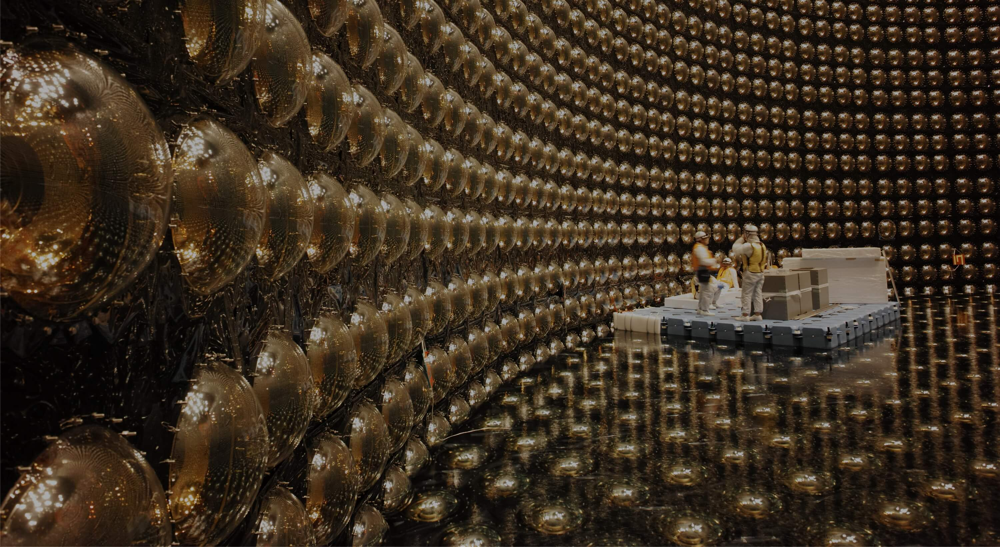
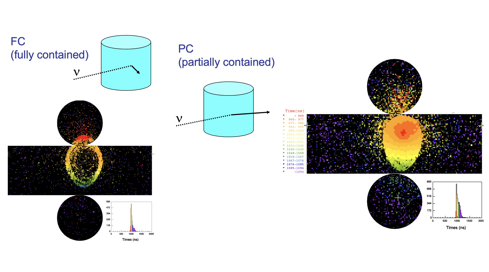
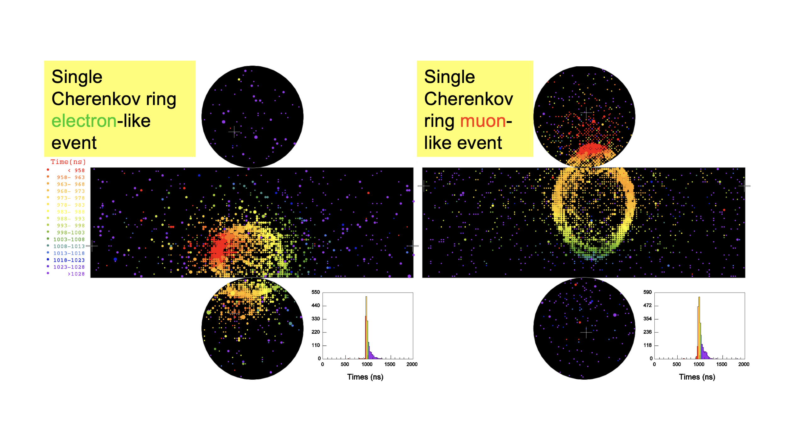
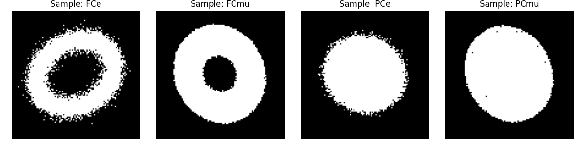
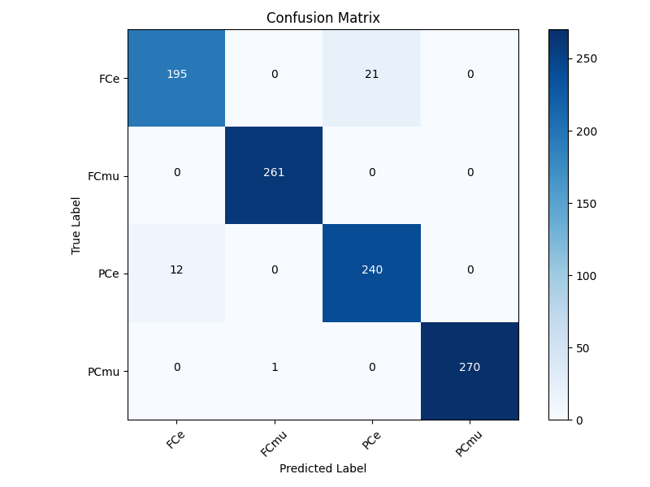
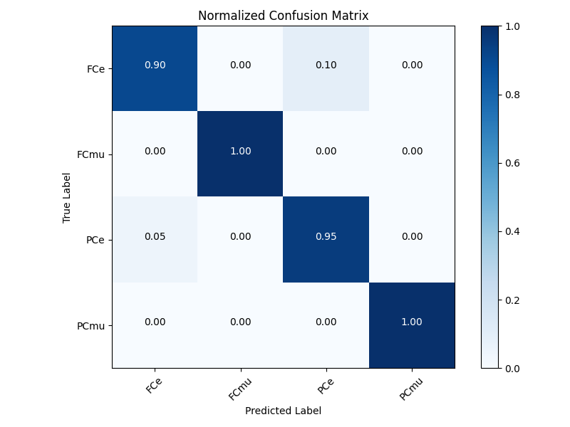
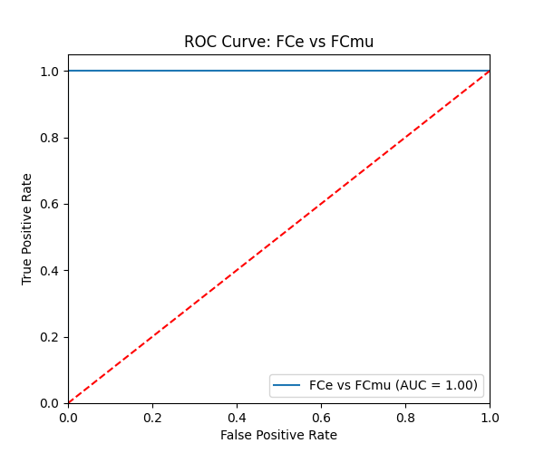
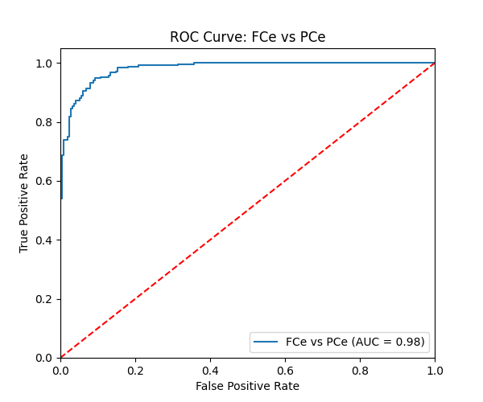
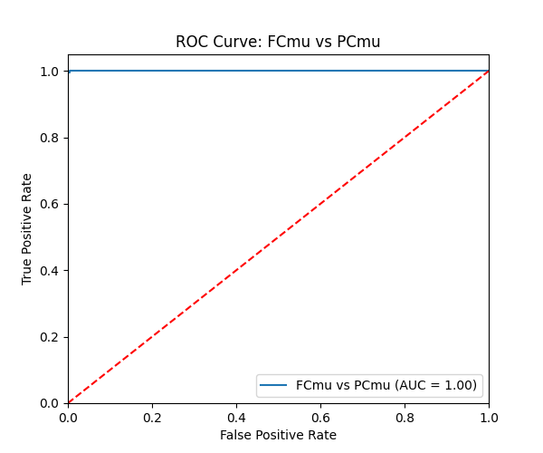

# CNN4SK: A Machine Learning Approach for Cherenkov Event Classification



### Table of Contents

1. [Introduction](#introduction)  
2. [Project Structure](#project-structure)
3. [Physics Overview](#physics-overview)
4. [Scripts Overview](#scripts-overview)  
5. [Usage Instructions](#usage-instructions)
6. [Conclusions](#conclusions)
7. [Key Libraries and Requirements](#key-libraries-and-requirements)

## Introduction

This work is the exam project for the Software and Computing for Nuclear and Subnuclear Physics course at the University of Bologna (UniBO). This repository contains a workflow for emulating Cherenkov events in a water-based detector and classifying these events using a Machine Learning model (ResNet50).

This project:

- **Generates** synthetic 2D images that approximate Cherenkov rings for different particle types (e or µ) and topologies (Fully Contained or Partially Contained).  
- **Trains** a CNN-based classifier (ResNet50 backbone) to differentiate the events.  
- **Evaluates** the trained model on a test set, providing classification metrics and visualization (Confusion Matrix, ROC curves).

## Project Structure

This repository contains the following content:

```text
CNN4SK/ 
  ├── generate.py
  ├── train.py
  ├── evaluate.py
  ├── event_display.zip
  ├── event_display_evaluate.zip
  ├── README.md
  └── pictures/
```

- **`generate.py`**  
  Produces synthetic Cherenkov event images and saves them in subfolders according to their class (`FCe`, `FCmu`, `PCe` or `PCmu`).

- **`train.py`**  
  Loads the generated dataset, sets up the ResNet50 model with custom layers and trains the classifier.

- **`evaluate.py`**  
  Loads the trained model for inference and produces performance metrics, including confusion matrices and ROC curves.

- **`event_display.zip`**  
  Training dataset (compressed) generated by `generate.py`. It is organized in subfolders (`FCe`, `FCmu`, `PCe` and `PCmu`).
  
- **`event_display_evaluate.zip`**  
  Evaluation dataset (compressed), without any subfolder.

- **`README.md`**  
  The primary documentation file explaining the project’s objectives, setup and usage instructions.
  
- **`pictures/`**  
  Pictures contained in the present document.
  
## Physics Overview

### Premise :warning:

This project has been *inspired* by the Super-Kamiokande (SK) neutrino observatory in Japan.
However, the generator script `generate.py` **does not perform a proper, full physical simulation of SK events**. Instead, it will generate images with some features that resemble real SK event displays.

The aim of this project is to give a very simplified, preliminary answer to the question:

>*Can CNN architectures such as ResNet50 be used in SK-like neutrino observatories to classify e-like, μ-like, fully contained (FC) and partially contained (PC) events?*

### FC vs PC events

- **Fully Contained (FC)** events occur when the charged particle from the neutrino interaction remains entirely within the detector. The Cherenkov light emitted by the charged particle forms a cone and its projection on the detector walls creates a ring-like shape.
- In contrast, **Partially Contained (PC)** events happen when the charged particle exits the detector. In this case, the Cherenkov light produces a filled elliptical shape.



### e vs μ events

In Super-Kamiokande, e-like and μ-like events differ due to the distinct behaviors of electrons and muons when they travel in a medium and emit Cherenkov light.

- **Electrons** interact strongly with the water via multiple scattering and electromagnetic showering. The result is a diffuse, fuzzy ring or filled pattern.
- **Muons**, being heavier, travel in nearly straight lines and do not shower as electrons do. Their Cherenkov light is emitted along a single well-defined path, producing a sharp, clean ring or filled pattern.

This difference in the Cherenkov patterns is critical for distinguishing between interactions caused by electron neutrinos (e-like) and muon neutrinos (μ-like).


  
### Main limitations :warning:

- In actual experiments, the detector geometry can be much more complex, for example a large cylindrical tank lined with thousands of photomultiplier tubes. By contrast, this dataset generator models only a single two-dimensional plane to represent light detection, rather than a curved surface. This script treats light detection as a uniform pixel grid.
- The generator assumes an unattenuated cone emission, without accounting for wavelength-dependent attenuation or other realistic optical effects. It also does not address photostatistics or dark noise, both of which can influence the actual number of photoelectrons recorded by each PMT.
- This dataset generation does not physically model the full multiple scattering process that charged particles undergo in water. Instead, it applies a simple Gaussian noise component to each ellipse point, which increases with the progression of the particle’s motion. This approximation emulates a *broader* Cherenkov ring edge, but does not replicate the detailed scattering interactions that would occur inside a real detector volume.
- In the actual detector, geometric and fiducial volume cuts are applied. These have not been taken into consideration in the generator script.

## Scripts Overview

### Event generator `generate.py`

**Role**: Synthetic Data Generation

1. **Parameter Generation** Randomly selects particle ID (e.g., “e” or “mu”), topology (e.g., “FC” or “PC”), azimuthal angle φ, polar angles θ, birth and death distances for the charged leptons with respect to the plane.
2. **Incremental Ellipse Drawing** 
	- A sequence of ellipses is generated at discrete intervals (num_steps) between the outer and inner distances, scaled and oriented according to the Cherenkov angle, θ and φ. 
	- The script calculates the major and minor semi-axes at each step and renders an ellipse on a 2D grid.
3. **Noise and Multiple Coulomb Scattering** 
	- A Gaussian random displacement (larger for e-like events) is applied to each point of the ellipse. 
	- Noise growth over the trajectory is implemented to mimic increased scattering towards the end of the path.
4. **Field-of-View Checks** If the generated ellipse lies outside the detector’s 2D window, the event is discarded.
5. **Output and Labeling** 
	- Valid events are saved as 2D black and white images. 
	- The file naming and folder scheme encodes the topology (e.g., “FC” or “PC”) and particle ID (e.g., “e” or “mu”).

### Training script `train.py`

**Role**: Model Training

1. **Data Loading**: Reads images from the `event_display/` directory using a Keras ImageDataGenerator for data augmentation.  
2. **Model Construction**:  
   - Loads a ResNet50 (pre-trained on ImageNet).  
   - Freezes the base layers.  
   - Adds a GlobalAveragePooling2D layer plus dense layers for final classification into four classes (FCe, FCmu, PCe, PCmu) or two classes depending on the classification approach.  
3. **Training Loop**:  
   - Optimizes the network via Adam or another suitable optimizer.  
   - Tracks validation performance; saves the best model weights to best_model.keras (if configured).  

### Evaluation script `evaluate.py`

**Role**: Model Evaluation  

1. **Model Loading**: Loads best_model.keras or the specified checkpoint.  
2. **Inference**: Runs predictions on a test dataset or a directory of images.  
3. **Performance Metrics**:  
   - Confusion Matrix (to visualize class-specific errors).  
   - Classification Report (precision, recall, F1).  
   - ROC Curves (one-vs-rest or one-vs-one).  
4. **Visualization**: Plots relevant figures (e.g., confusion matrix, normalized confusion matrix, per-class ROC curves).

## Usage Instructions

The first or first two steps can be skipped for a quick demonstration of the project: all the necessary files will be provided regardless, including the `best_model.keras` file.

### Generate the Dataset

1. *(Optional)* If needed, modify parameters in `generate_events.py` (e.g., number of images, image size, noise levels). The function responsible for noise scaling can also be customized.

```python
# General settings
num_images = 1000 # Number of images for each execution
num_steps = 100 # Number of steps during the motion of charged particles
ellipse_points = 360 # Number of points for each ellipse
color = 255 # White color
output_dir = "event_display" # Directory to save images

# Physical and geometric parameters
theta_cherenkov = 41 * np.pi / 180 # Cherenkov angle in radians (41 degrees)
image_size = (105, 105) # Image size (the number of photomultipliers in Super-Kamiokande is about 11k)
center = (image_size[0] // 2, image_size[1] // 2) # Image center
e_noise = 5 # Standard deviation of gaussian noise in e-like events
mu_noise = 1 # Standard deviation of gaussian noise in mu-like events

# Function to emulate noise scaling
def noise_func(sigma_noise, step):
    return sigma_noise * (0.5 + 0.5 * step / num_steps)
```

2. Run the script in a terminal:
```bash
python generate_events.py
```
3. Check that a new directory (e.g., `event_display_new`) has been created with four subfolders: `FCe`, `FCmu`, `PCe` and `PCmu`.  

The script will generate a console output such as the following (shortened):

```text
Event discarded.
Event discarded.
Event image saved as '000000_PCe.png'.
Event discarded.
Event image saved as '000001_FCmu.png'.
Event image saved as '000002_FCmu.png'.
Event discarded.
Event image saved as '000003_FCe.png'.
Event discarded.
Event image saved as '000004_PCe.png'.
[...]
Event image saved as '000999_FCe.png'.
```

### Train the Model

1. Ensure **train_model.py** points to the directory containing the generated images (default: `event_display_new`).  
2. Run the script:

```bash
python train_model.py
```

3. A ResNet50-based classifier will be trained.  
4. A model file (default: `best_model.keras`) will be saved according to the training script’s configuration and callbacks.

During execution the script will produce a text and graphical output such as the following:

```text
2024-12-29 18:31:15.348303: I tensorflow/core/platform/cpu_feature_guard.cc:210] This TensorFlow binary is optimized to use available CPU instructions in performance-critical operations.
To enable the following instructions: AVX2 FMA, in other operations, rebuild TensorFlow with the appropriate compiler flags.
TensorFlow version: 2.16.2
Available GPU devices: []
Image counts per class:
   FCe: 238 images
   FCmu: 256 images
   PCe: 273 images
   PCmu: 233 images
```




```text
Found 703 images belonging to 4 classes.
Found 297 images belonging to 4 classes.
Class indices: {'FCe': 0, 'FCmu': 1, 'PCe': 2, 'PCmu': 3}
Model: "functional"
┏━━━━━━━━━━━━━━━━━━━━━┳━━━━━━━━━━━━━━━━━━━┳━━━━━━━━━━━━┳━━━━━━━━━━━━━━━━━━━┓
┃ Layer (type)        ┃ Output Shape      ┃    Param # ┃ Connected to      ┃
┡━━━━━━━━━━━━━━━━━━━━━╇━━━━━━━━━━━━━━━━━━━╇━━━━━━━━━━━━╇━━━━━━━━━━━━━━━━━━━┩
│ input_layer         │ (None, 224, 224,  │          0 │ -                 │
│ (InputLayer)        │ 3)                │            │                   │
├─────────────────────┼───────────────────┼────────────┼───────────────────┤
│ conv1_pad           │ (None, 230, 230,  │          0 │ input_layer[0][0] │
│ (ZeroPadding2D)     │ 3)                │            │                   │
├─────────────────────┼───────────────────┼────────────┼───────────────────┤
│ conv1_conv (Conv2D) │ (None, 112, 112,  │      9,472 │ conv1_pad[0][0]   │
│                     │ 64)               │            │                   │
├─────────────────────┼───────────────────┼────────────┼───────────────────┤
│ conv1_bn            │ (None, 112, 112,  │        256 │ conv1_conv[0][0]  │
│ (BatchNormalizatio… │ 64)               │            │                   │
├─────────────────────┼───────────────────┼────────────┼───────────────────┤
│ conv1_relu          │ (None, 112, 112,  │          0 │ conv1_bn[0][0]    │
│ (Activation)        │ 64)               │            │                   │
├─────────────────────┼───────────────────┼────────────┼───────────────────┤
│ pool1_pad           │ (None, 114, 114,  │          0 │ conv1_relu[0][0]  │
│ (ZeroPadding2D)     │ 64)               │            │                   │
├─────────────────────┼───────────────────┼────────────┼───────────────────┤
│ pool1_pool          │ (None, 56, 56,    │          0 │ pool1_pad[0][0]   │
│ (MaxPooling2D)      │ 64)               │            │                   │
├─────────────────────┼───────────────────┼────────────┼───────────────────┤
│ conv2_block1_1_conv │ (None, 56, 56,    │      4,160 │ pool1_pool[0][0]  │
│ (Conv2D)            │ 64)               │            │                   │
├─────────────────────┼───────────────────┼────────────┼───────────────────┤
│ conv2_block1_1_bn   │ (None, 56, 56,    │        256 │ conv2_block1_1_c… │
│ (BatchNormalizatio… │ 64)               │            │                   │
├─────────────────────┼───────────────────┼────────────┼───────────────────┤
│ conv2_block1_1_relu │ (None, 56, 56,    │          0 │ conv2_block1_1_b… │
│ (Activation)        │ 64)               │            │                   │
├─────────────────────┼───────────────────┼────────────┼───────────────────┤
│ [...]               │ [...]             │ [...]      │ [...]             │
├─────────────────────┼───────────────────┼────────────┼───────────────────┤
│ conv5_block3_2_bn   │ (None, 7, 7, 512) │      2,048 │ conv5_block3_2_c… │
│ (BatchNormalizatio… │                   │            │                   │
├─────────────────────┼───────────────────┼────────────┼───────────────────┤
│ conv5_block3_2_relu │ (None, 7, 7, 512) │          0 │ conv5_block3_2_b… │
│ (Activation)        │                   │            │                   │
├─────────────────────┼───────────────────┼────────────┼───────────────────┤
│ conv5_block3_3_conv │ (None, 7, 7,      │  1,050,624 │ conv5_block3_2_r… │
│ (Conv2D)            │ 2048)             │            │                   │
├─────────────────────┼───────────────────┼────────────┼───────────────────┤
│ conv5_block3_3_bn   │ (None, 7, 7,      │      8,192 │ conv5_block3_3_c… │
│ (BatchNormalizatio… │ 2048)             │            │                   │
├─────────────────────┼───────────────────┼────────────┼───────────────────┤
│ conv5_block3_add    │ (None, 7, 7,      │          0 │ conv5_block2_out… │
│ (Add)               │ 2048)             │            │ conv5_block3_3_b… │
├─────────────────────┼───────────────────┼────────────┼───────────────────┤
│ conv5_block3_out    │ (None, 7, 7,      │          0 │ conv5_block3_add… │
│ (Activation)        │ 2048)             │            │                   │
├─────────────────────┼───────────────────┼────────────┼───────────────────┤
│ global_average_poo… │ (None, 2048)      │          0 │ conv5_block3_out… │
│ (GlobalAveragePool… │                   │            │                   │
├─────────────────────┼───────────────────┼────────────┼───────────────────┤
│ dense (Dense)       │ (None, 256)       │    524,544 │ global_average_p… │
├─────────────────────┼───────────────────┼────────────┼───────────────────┤
│ dropout (Dropout)   │ (None, 256)       │          0 │ dense[0][0]       │
├─────────────────────┼───────────────────┼────────────┼───────────────────┤
│ dense_1 (Dense)     │ (None, 4)         │      1,028 │ dropout[0][0]     │
└─────────────────────┴───────────────────┴────────────┴───────────────────┘
 Total params: 24,113,284 (91.98 MB)
 Trainable params: 525,572 (2.00 MB)
 Non-trainable params: 23,587,712 (89.98 MB)
Epoch 1/25
44/44 ━━━━━━━━━━━━━━━━━━━━ 75s 2s/step - accuracy: 0.3465 - loss: 1.4604 - val_accuracy: 0.7374 - val_loss: 0.9838
Epoch 2/25
44/44 ━━━━━━━━━━━━━━━━━━━━ 67s 2s/step - accuracy: 0.5185 - loss: 1.1174 - val_accuracy: 0.8889 - val_loss: 0.7658
Epoch 3/25
44/44 ━━━━━━━━━━━━━━━━━━━━ 67s 2s/step - accuracy: 0.6559 - loss: 0.8363 - val_accuracy: 0.9024 - val_loss: 0.6381
Epoch 4/25
44/44 ━━━━━━━━━━━━━━━━━━━━ 67s 2s/step - accuracy: 0.7458 - loss: 0.7085 - val_accuracy: 0.9024 - val_loss: 0.5471
Epoch 5/25
44/44 ━━━━━━━━━━━━━━━━━━━━ 67s 2s/step - accuracy: 0.8115 - loss: 0.6022 - val_accuracy: 0.9125 - val_loss: 0.4878
Epoch 6/25
44/44 ━━━━━━━━━━━━━━━━━━━━ 66s 2s/step - accuracy: 0.8218 - loss: 0.5389 - val_accuracy: 0.9226 - val_loss: 0.4375
Epoch 7/25
44/44 ━━━━━━━━━━━━━━━━━━━━ 67s 2s/step - accuracy: 0.8971 - loss: 0.4511 - val_accuracy: 0.9125 - val_loss: 0.3931
Epoch 8/25
44/44 ━━━━━━━━━━━━━━━━━━━━ 67s 2s/step - accuracy: 0.8920 - loss: 0.4158 - val_accuracy: 0.9259 - val_loss: 0.3602
Epoch 9/25
44/44 ━━━━━━━━━━━━━━━━━━━━ 67s 2s/step - accuracy: 0.9039 - loss: 0.3740 - val_accuracy: 0.9293 - val_loss: 0.3277
Epoch 10/25
44/44 ━━━━━━━━━━━━━━━━━━━━ 67s 2s/step - accuracy: 0.9034 - loss: 0.3769 - val_accuracy: 0.9529 - val_loss: 0.2881
Epoch 11/25
44/44 ━━━━━━━━━━━━━━━━━━━━ 67s 2s/step - accuracy: 0.9140 - loss: 0.3457 - val_accuracy: 0.9360 - val_loss: 0.2786
Epoch 12/25
44/44 ━━━━━━━━━━━━━━━━━━━━ 67s 2s/step - accuracy: 0.8916 - loss: 0.3464 - val_accuracy: 0.9394 - val_loss: 0.2651
Epoch 13/25
44/44 ━━━━━━━━━━━━━━━━━━━━ 67s 2s/step - accuracy: 0.9200 - loss: 0.3248 - val_accuracy: 0.9293 - val_loss: 0.2508
Epoch 14/25
44/44 ━━━━━━━━━━━━━━━━━━━━ 67s 2s/step - accuracy: 0.9170 - loss: 0.3009 - val_accuracy: 0.9428 - val_loss: 0.2445
Epoch 15/25
44/44 ━━━━━━━━━━━━━━━━━━━━ 67s 2s/step - accuracy: 0.9339 - loss: 0.2798 - val_accuracy: 0.9495 - val_loss: 0.2142
Epoch 16/25
44/44 ━━━━━━━━━━━━━━━━━━━━ 67s 2s/step - accuracy: 0.9151 - loss: 0.2610 - val_accuracy: 0.9495 - val_loss: 0.2128
Epoch 17/25
44/44 ━━━━━━━━━━━━━━━━━━━━ 67s 2s/step - accuracy: 0.9355 - loss: 0.2439 - val_accuracy: 0.9461 - val_loss: 0.1947
Epoch 18/25
44/44 ━━━━━━━━━━━━━━━━━━━━ 67s 2s/step - accuracy: 0.9331 - loss: 0.2289 - val_accuracy: 0.9562 - val_loss: 0.1912
Epoch 19/25
44/44 ━━━━━━━━━━━━━━━━━━━━ 67s 2s/step - accuracy: 0.9396 - loss: 0.2221 - val_accuracy: 0.9596 - val_loss: 0.1776
Epoch 20/25
44/44 ━━━━━━━━━━━━━━━━━━━━ 66s 2s/step - accuracy: 0.9523 - loss: 0.2204 - val_accuracy: 0.9327 - val_loss: 0.1978
Epoch 21/25
44/44 ━━━━━━━━━━━━━━━━━━━━ 67s 2s/step - accuracy: 0.9394 - loss: 0.2126 - val_accuracy: 0.9529 - val_loss: 0.1690
Epoch 22/25
44/44 ━━━━━━━━━━━━━━━━━━━━ 67s 2s/step - accuracy: 0.9235 - loss: 0.2335 - val_accuracy: 0.9562 - val_loss: 0.1689
Epoch 23/25
44/44 ━━━━━━━━━━━━━━━━━━━━ 67s 2s/step - accuracy: 0.9339 - loss: 0.2205 - val_accuracy: 0.9562 - val_loss: 0.1612
Epoch 24/25
44/44 ━━━━━━━━━━━━━━━━━━━━ 67s 2s/step - accuracy: 0.9409 - loss: 0.2181 - val_accuracy: 0.9663 - val_loss: 0.1452
Epoch 25/25
44/44 ━━━━━━━━━━━━━━━━━━━━ 66s 2s/step - accuracy: 0.9674 - loss: 0.1505 - val_accuracy: 0.9529 - val_loss: 0.1623
```

### Evaluate the Model

Link best_model.keras: 


<https://tinyurl.com/2wju8t33>


1. Once training is complete, run:

```bash
python evaluate_model.py
```

2. Ensure that **evaluate_model.py** references the correct path for the test set (could be within the same directory if a validation split is used, or a separate folder for a truly unseen test).  
3. The script outputs confusion matrices, classification reports, and plots ROC curves (or one-vs-rest curves for multi-class scenarios).  
4. Check the console output and any generated figures to interpret the classifier’s performance.

During execution the script will produce a text and graphical output such as the following:

```text
2024-12-29 22:46:25.342048: I tensorflow/core/platform/cpu_feature_guard.cc:210] This TensorFlow binary is optimized to use available CPU instructions in performance-critical operations.
To enable the following instructions: AVX2 FMA, in other operations, rebuild TensorFlow with the appropriate compiler flags.
1/1 ━━━━━━━━━━━━━━━━━━━━ 2s 2s/step
1/1 ━━━━━━━━━━━━━━━━━━━━ 0s 106ms/step
1/1 ━━━━━━━━━━━━━━━━━━━━ 0s 106ms/step
1/1 ━━━━━━━━━━━━━━━━━━━━ 0s 100ms/step
1/1 ━━━━━━━━━━━━━━━━━━━━ 0s 104ms/step
1/1 ━━━━━━━━━━━━━━━━━━━━ 0s 98ms/step
1/1 ━━━━━━━━━━━━━━━━━━━━ 0s 107ms/step
1/1 ━━━━━━━━━━━━━━━━━━━━ 0s 100ms/step
1/1 ━━━━━━━━━━━━━━━━━━━━ 0s 105ms/step
1/1 ━━━━━━━━━━━━━━━━━━━━ 0s 104ms/step
[...]
1/1 ━━━━━━━━━━━━━━━━━━━━ 0s 104ms/step

Confusion Matrix:
 [[195   0  21   0]
 [  0 261   0   0]
 [ 12   0 240   0]
 [  0   1   0 270]]

Classification Report:
               precision    recall  f1-score   support

         FCe       0.94      0.90      0.92       216
        FCmu       1.00      1.00      1.00       261
         PCe       0.92      0.95      0.94       252
        PCmu       1.00      1.00      1.00       271

    accuracy                           0.97      1000
   macro avg       0.96      0.96      0.96      1000
weighted avg       0.97      0.97      0.97      1000

F1 Score (Macro): 0.9635
F1 Score (Weighted): 0.9659
Confusion Matrix, without normalization
Normalized Confusion Matrix
lorenzo@MacBook Pro sc_GitHub % 
```







## Conclusions

1. Classification metrics, confusion matrices and ROC curves indicate a very good performance of the fine-tuned model for this task.
2. Some degree of confusion is visible between `FCe` and `PCe` events.
3. The ROC curve for this specific pair of events also reflects such behavior.
4. The reason for this might reside in the dataset generator: fully contained electron events with small internal radii might be entirely filled up by the noise.
5. If this is the case, increasing the training dataset or unfreezing some layers of ResNet50 might prove ineffective for increasing performance.
6. The 33% minimum ratio between death and birth distances could be raised to prevent this effect. However, the default configuration allows the user to explore *fringe* cases with a very small pixel-like central hole.

## Key Libraries and Requirements

- **Python 3.7+** 
- **TensorFlow (Keras)** (for machine learning functionality)  
- **NumPy** (array operations and numerical computations)  
- **Matplotlib** (visualizations for confusion matrix, ROC curves)  
- **Pillow (PIL)** (image writing)  
- **scikit-learn** (classification metrics, confusion matrix, ROC utilities)

Installation example (using pip):

```bash
pip install tensorflow numpy matplotlib pillow scikit-learn
```